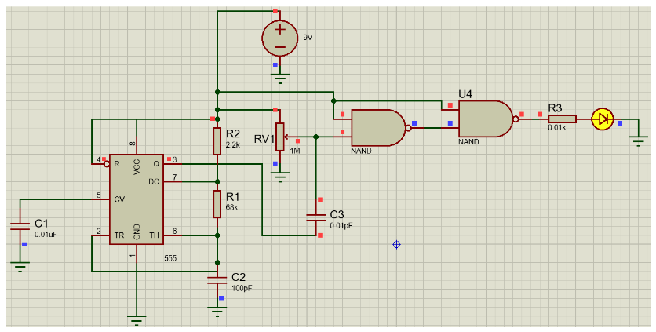
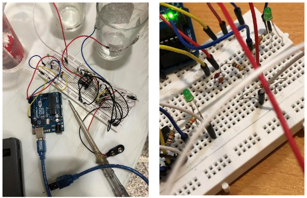
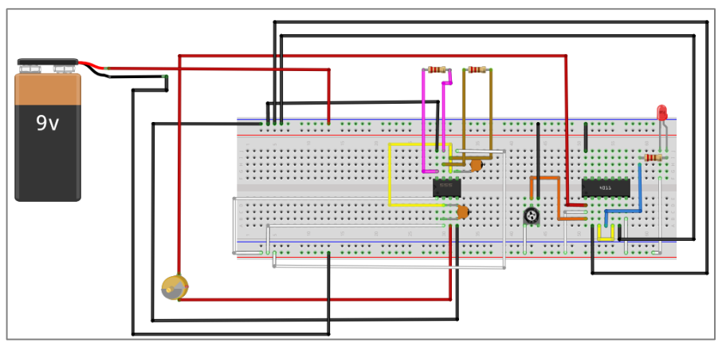

# Measurement-Systems-Course-Project
Instructor: Dr. Moosa Ayati

# Capacitive Proximity Sensor Project

## Project Overview

This project explores the design, simulation, and implementation of capacitive proximity sensors. The work was divided into two phases, focusing on both theoretical and practical aspects of the sensors.

## Phase 1: Theoretical Exploration

### 1. Introduction to Proximity Sensors

We began by introducing various types of proximity sensors, with a focus on capacitive proximity sensors. The structure, types, and applications of these sensors were discussed in detail.

### 2. Circuit Design and Simulation

The project's theoretical section included a detailed discussion of the box diagram used in the design. Two distinct circuits were designed and analyzed, each with different functional characteristics:

- **Components Used:** Arduino Uno, aluminum plates, capacitors, timers, etc.
- **Noise Reduction:** A low-pass filter was implemented to minimize noise.
- **Kalman Filter:** A Kalman filter was added in the code to average the last ten values, improving the reliability of the sensor readings.

### 3. Software Tools

The circuits were simulated using Fritzing and Proteus software. Below is an example of the simulation result in Proteus:

### 4. Limitations

This phase did not require dynamic analysis, box diagram analysis, or MATLAB simulation. The focus was on using experimental data to calibrate the system, which is related to the next part of this project and outside the scope of this report.

## Phase 2: Practical Implementation

### 1. Circuit Construction

The designed circuits were constructed and tested in real-world conditions. Several challenges were encountered:

- **Connection Stability:** Soldering was recommended for better connections but was replaced with electrical glue due to time constraints.
- **Noise Issues:** Noise was reduced by applying a low-pass filter.
- **Value Stability:** High vibrations in the reported values were mitigated using a Kalman filter.

Below is the constructed circuit setup:

### 2. Performance and Challenges

The performance of the circuits in practical conditions differed significantly from the theoretical predictions:

- **Non-Arduino Circuit:** The first circuit, which did not use an Arduino, failed to reach the operational stage, and the cause of this failure was not determined.
- **Arduino-Based Circuit:** The second circuit, utilizing an Arduino, worked under two conditions:
  - **Hand Detection:** The sensor could detect the distance between a hand and the aluminum plate at approximately 5 cm.
  - **Water Detection:** The sensor was less sensitive to water but functioned effectively as a water switch. When water approached the capacitor, the readings increased exponentially, indicating its presence without contact.

Here's an image of the actual circuit:

### 3. Application Example

In a practical application, the aluminum plate was attached to the outer body of a glass. When the glass reached a certain proximity limit, an LED light was triggered to turn on.

## Conclusion

This project provided valuable insights into the design and practical challenges of capacitive proximity sensors. While the theoretical simulations were promising, real-world implementation highlighted the need for further refinement and calibration, particularly in terms of noise reduction and stability.
